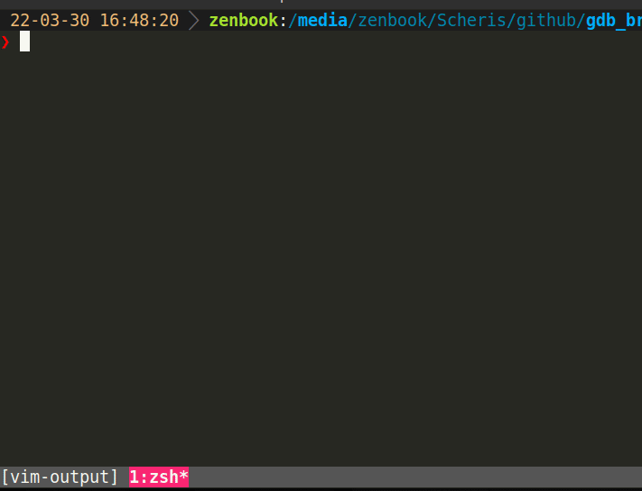

# GDB breakpoint like python's breakpoint

Launch `ugdb` and attach to current process with new tmux window.



``` rust
use gdb_breakpoint::breakpoint;

pub fn main() {
    let x = 3 + 4;
    breakpoint();
}
```

Require nightly.

## set ptrace_scope

```
echo 0 | sudo tee /proc/sys/kernel/yama/ptrace_scope
```

Make gdb to attach to the program.

## Recommendation

Multithreadding rust programs can call `SIGSTOP` many times. I recommend you to add following command into your `.gdbinit` file. So I used `SIGINT` instead of `SIGSTOP` on the second and later `breakpoint` calls.

```
handle SIGSTOP "nostop" "pass" "noprint"
```
